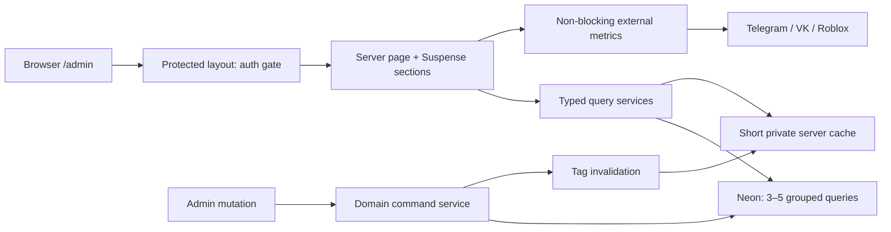

# `/admin`: ultra-review производительности и план оптимизации — 04.08.2026

Статус: **реализован и принят в production 05.08.2026**.

## Результат реализации

План реализован одним обратно совместимым performance-релизом без смены VPS и без
спекулятивных индексов. Закрыты оба correctness P0, а основные чтения переведены на
server-first DTO, ограниченные выборки и короткий tagged cache после admin-auth.

| Контур | Было | Реализовано |
|---|---|---|
| Dashboard | 23 Prisma operations, pool max 3 | 4 логических cold-miss чтения; operational TTL 10 s, finance TTL 60 s |
| Orders | последние 250 строк и client-only поиск | server search по всей базе, стабильный cursor `(createdAt,id)`, 50 строк |
| Users | вся аудитория + блокирующие TG/VK | server cursor/search, 50 DTO; community widgets в отдельном Suspense и TTL 300 s |
| Activity | до 620 строк, merge/sort в Node | стабильный server cursor, 80 событий |
| Economics | TWA-only save и oldest-first limit | отдельный admin-auth endpoint; newest-first stable limit и явный `truncated` |
| Buyout | initial `useEffect`, 6 count-запросов, stale tab race | server initial state, один aggregate, abort/request token; donor только явно и до 12 s |
| «Антон» | initial fetch после hydration | initial state из канонического server loader без второго backend |
| Навигация | искусственный фиксированный loader 1.5 s | route-level `loading.tsx`/`error.tsx` |
| БД | pool max 3 | конфигурируемый `DB_POOL_MAX`, безопасный default 5 после read-only A/B |
| Метрики | только stdout контейнера | PII-free `PerformanceSample`, web vitals/errors только для `/admin`; benchmark 15 прогонов |

Проверка на реальной БД до rollout: одновременная загрузка dashboard, Orders, Users,
Buyout и Economics завершилась примерно за `1.15 s`; dashboard — `0.95 s`, Users —
`1.15 s`, Buyout — `0.80 s`. Это server-loader измерения, а не браузерный production SLA.
Итоговый браузерный before/after публикуется только после production-приёмки.

Отложено отдельной безопасной волной: физическое разбиение 3265-строчного partner route,
переход всего приложения на Cache Components и last-known donor snapshot. Эти задачи не
нужны для удаления initial waterfall и затрагивают более рискованный денежный контур.

Production-canary обнаружил и закрыл cache-boundary регрессию до завершения приёмки:
`unstable_cache` не сериализует Prisma `bigint`, а при cache hit восстанавливает `Date` как
строку. Dashboard loaders теперь преобразуют aggregates в `number`, а даты/recent orders —
в JSON-safe DTO **до** помещения в Next Data Cache. Регресс-тест проверяет строковые даты и
полную JSON-сериализуемость dashboard result.

### Production acceptance

Финальный Web и Guide собраны из одного source fingerprint; storefront smoke — `15/15`,
Web↔Guide corridor — `31/31`. После hotfix в runtime нет BigInt/Date/Prisma exceptions.
Авторизованный Chrome подтвердил Dashboard, Orders, Users, Activity, Economics, Buyout и
партнёра «Антон». Серверный Orders search нашёл заказ глубже прежнего окна 250 строк.

| Route | Baseline 04.08 | Production after 05.08 | Вывод |
|---|---:|---:|---|
| Dashboard | полное открытие ~4.90 s | warm TTFB ~1.45 s; FCP 1.70–2.03 s | сильное улучшение, но цель warm p50 ≤1.2 s ещё не доказана |
| Orders | полное открытие ~3.65 s | обычный TTFB 1.44 s; FCP 1.63 s | целевой first page достигнут; deep search 3.02 s TTFB |
| Users | полное открытие ~9.35 s | warm TTFB 1.46–1.48 s; FCP 1.74–1.88 s | основной список достиг цели и больше не ждёт TG/VK |
| Activity | полное открытие ~2.20 s | warm TTFB 1.41 s; FCP/LCP 1.62 s | warm budget достигнут; cold sample 2.61–2.99 s |
| Economics | client waterfall после HTML | FCP 1.57 s | initial data server-first, экран прошёл |
| Buyout | client waterfall и stale race | TTFB 1.44 s; FCP/LCP 1.63 s | server-first и fresh reload прошли |
| «Антон» | client waterfall после hydration | TTFB 2.02 s; FCP/LCP 2.22 s | server-first прошёл; физический refactor отдельно |

Это небольшой acceptance-срез, а не статистически устойчивый p50/p95 из 15 прогонов.
`PerformanceSample` уже накапливает PII-free ряд; регулярный отчёт должен сравнивать хотя бы
15 warm прогонов одной версии. Cold dashboard и Activity по-прежнему чувствительны к
удалённой БД: апгрейд текущего VPS не исправит DB RTT, а решение о co-location БД/compute
нужно принимать по накопленным TTFB и host saturation.

Этот документ отвечает на три вопроса:

1. почему desktop `/admin` местами открывается 4–9 секунд;
2. какие баги и архитектурные тупики нужно устранить до дальнейшего роста;
3. в каком порядке внедрять изменения, как измерять результат и как откатывать релизы.

## 1. Решение в одном абзаце

Переезд с текущего VPS сейчас **не является приоритетной оптимизацией**. У сервера есть
запас CPU, RAM и диска, а origin отвечает примерно за `82–100 ms`. Основной лимит —
удалённая БД с тёплым round-trip около `195–196 ms`, умноженный на число последовательных
волн запросов, плюс client-side waterfalls на Users, Economics, Buyout и партнёре «Антон».
Первый эффект даст сокращение dashboard с 23 запросов до 3–5 логических запросов,
server-side initial data, пагинация, изоляция внешних TG/VK/Roblox API и короткий
server-side cache после проверки прав. Миграцию VPS имеет смысл обсуждать только если
после этих работ серверные CPU/RAM/queue time станут измеренным ограничением.

## 2. Фактический baseline

Замеры сделаны на production 04.08.2026. Значения браузера — один authenticated прогон,
поэтому это не SLA, а отправная точка; волна P0 добавит воспроизводимый p50/p95 benchmark.

| Участок | Факт | Вывод |
|---|---:|---|
| VPS | 2 vCPU, 4 GB RAM | конфигурация умеренная, но не текущий bottleneck |
| CPU | 73–96% idle | существенный запас |
| Память | около 2 GB available | нет давления памяти |
| Диск | 31% занято, iowait 0–2% | диск не ограничивает запросы |
| Web container | около 249 MB, почти 0% CPU в покое | нет признаков saturation |
| Origin `/` TTFB | около 82 ms | приложение рядом с VPS отвечает быстро |
| Origin `/api/health` TTFB | около 100 ms | базовый HTTP/runtime не объясняет 4–9 секунд |
| Neon `SELECT 1`, warm | 195–196 ms | один DB round-trip дорогой относительно SQL execution |
| Neon cold outliers | 616–1424 ms | холодный путь усиливает client waterfalls |
| `/admin` | около 4.90 s | dashboard делает слишком много DB-волн |
| `/admin/orders` | около 3.65 s | фиксированные 250 строк, hydration и auth/DB |
| `/admin/users` | около 9.35 s | вся аудитория + блокирующие Telegram/VK API |
| `/admin/activity` | около 2.20 s | четыре выборки и merge/sort в памяти |

Production-таблицы пока малы: `WbOrder` — 663 строки, `User` — 618, `WbCode` — 2559,
`PartnerBuyoutTask` — 206. `EXPLAIN ANALYZE` для dashboard/recent/activity дал примерно
`0.03–0.38 ms` execution time. Поэтому последовательное добавление индексов сейчас почти
ничего не ускорит: стоимость SQL меньше сетевого round-trip в сотни раз.

## 3. Карта находок

### P0 — исправить отдельным hotfix до оптимизаций

#### P0.1. Web Economics сохраняет курс через TWA-only endpoint и получает `401`

- `AdminEconomicsClient` отправляет `POST /api/twa/settings`.
- `/api/twa/settings` принимает только TWA Bearer identity через `extractTwaUser`.
- Desktop web session не посылает этот Bearer token.

Итог: изменение курса из `/admin/economics` функционально сломано. Нельзя «починить» это
ослаблением TWA-auth. Нужен общий settings service и два тонких auth-adapter:
`/api/admin/settings` через `requireAdmin`, `/api/twa/settings` через TWA identity.

#### P0.2. Economics после 2000 заказов показывает старые данные вместо новых

`src/lib/direct-economics.ts` делает `orderBy createdAt: "asc", take: 2000`. При росте
таблицы предел фиксирует **самые старые** 2000 заказов и незаметно исключает новые. Это
ошибка финансовой картины, а не только производительности.

Hotfix должен выбирать newest-first со стабильным вторичным порядком и возвращать явный
признак `hasMore/truncated`. Целевое решение следующей волны — период и server pagination,
а не передача 2000 raw rows в браузер.

### P1 — главные источники задержки и пользовательских ошибок

| ID | Находка | Последствие |
|---|---|---|
| P1.1 | `getAdminDashboardData` запускает 23 DB operations при pool `max=3` | примерно восемь сетевых волн; один dashboard легко тратит секунды только на RTT |
| P1.2 | Users читает всех пользователей, identity metadata и `_count`, затем ждёт live Telegram и VK API | список клиентов заблокирован медленными внешними сервисами; сейчас худшая страница |
| P1.3 | Orders загружает только последние 250, а поиск работает локально | UI обещает поиск по базе, но старые заказы невидимы; операционный тупик при росте |
| P1.4 | Economics, Buyout и «Антон» получают initial data только в `useEffect` | HTML → JS/hydration → API → DB; лишний client waterfall и повторная auth-проверка |
| P1.5 | Buyout допускает несколько параллельных tab reads без cancellation/request token | медленный старый response может перезаписать данные уже выбранной вкладки |
| P1.6 | Donor-проверка способна ждать до 70 секунд и не отделена от обычного чтения | зависший внешний Roblox path воспринимается как зависшая админка |
| P1.7 | client vitals/errors остаются только в stdout текущего контейнера | после deploy/restart нельзя получить исторические p50/p95 и доказать улучшение |

### P2 — масштабирование, поддерживаемость и скрытая цена изменений

- `src/app/api/twa/partners/[slug]/tasks/route.ts` — 3265 строк: auth, HTTP, XLSX,
  Google Sheets, Roblox, Prisma, ledger и DTO живут в одном route. Почти каждая команда
  повторно собирает тяжёлый state через 11 параллельных запросов и дополнительные проходы.
- `src/lib/admin-ecosystem.ts` читает лишние данные: `siteOrders` не используется UI,
  `claimedCodes` не нужен dashboard, а `customerOrderCounts` переносит сотни group rows,
  чтобы получить два числа.
- Order detail использует широкие `include`: полный `User` (включая ненужный password hash),
  payment/refund/event/outbox payload. Это лишний transfer и риск случайного расширения DTO.
- Activity загружает до `180 + 180 + 180 + 80` строк, объединяет и сортирует их в Node,
  но не имеет cursor pagination.
- Buyout endpoint после auth выполняет экспорт/батчи/drains и шесть отдельных count-запросов.
- `PageLoader` показывается фиксированные 1500 ms, а не реальное состояние navigation:
  быстрый переход искусственно выглядит медленным, долгий теряет индикатор раньше результата.
- В критических admin/TWA-файлах около 100 `any`/`as any`; это скрывает schema drift.
- Остались неиспользуемые `product-list.tsx` и `add-product-modal.tsx`, которые ссылаются
  на уже удалённый `/api/admin/products`.
- Внутри admin нет собственных `loading.tsx`/`error.tsx`, поэтому отсутствуют локальные
  streaming/recovery boundaries.

## 4. Целевая архитектура чтения

Правила:

1. Auth/permission check остаётся блокирующим и **никогда** не кэшируется между запросами.
2. Кэшируется только безопасный server-side результат после auth; PII API явно получает
   `Cache-Control: private, no-store`, browser/CDN cache не используется.
3. Route handlers не вызывают друг друга по HTTP: web и TWA используют общий domain/query
   service с разными auth adapters.
4. Первый экран приходит с server render. Долгие внешние данные показываются отдельным
   Suspense/last-known блоком и не задерживают основной список.
5. Списки имеют cursor pagination и server search; браузер не считается базой данных.

## 5. Cache contract для текущего Next.js 16

В проекте сейчас legacy caching model: `cacheComponents` не включён. В первой реализации
используется совместимый мост `unstable_cache` с tag/revalidate и двухаргументный
`revalidateTag(tag, "max")`. Включение Cache Components меняет поведение всего приложения
и вынесено в отдельную контролируемую волну после стабилизации.

| Домен | Рекомендуемый TTL | Invalidation |
|---|---:|---|
| Dashboard operational: open/active/errors/outbox/heartbeat | 10 s | order/payment/outbox/admin action |
| Dashboard finance/history/source totals | 60 s | completion/refund/payment confirmation |
| Community TG/VK metrics | 300 s + last-known-good | ручной refresh или TTL |
| FAQ/reviews public reads | 60 s | соответствующий CRUD |
| Order/user lists and detail | без shared cache | cursor query всегда после auth |
| Admin actor/grant/session | запрещён | проверка на каждый request/navigation |
| Mutation response | без cache | invalidates affected tags |

Точный TTL — один из пунктов согласования в §10.

## 6. План реализации по релизным волнам

### Волна 0 — измеримость и воспроизводимый baseline, 0.5–1 день

**Работы**

- Добавить read-only benchmark authenticated admin routes: warm-up, минимум 15 прогонов,
  p50/p95 для RSC/navigation/API, размер response и число DB operations.
- Добавить PII-safe structured timings: request id, route, auth time, DB query group,
  external service time, cache hit/miss; не логировать email, username, cookie и payload.
- Добавить `Server-Timing` для собственных admin API там, где это не раскрывает внутренние
  данные; настроить сохранение/агрегацию метрик между рестартами контейнера.
- Зафиксировать baseline на staging/production read-only и thresholds в CI/perf report.

**Файлы/области**: `src/instrumentation.ts`, `src/lib/prisma.ts`, observability API,
новый `scripts/benchmark-admin.mjs`, docs.

**Гейт**: два последовательных запуска дают сопоставимые p50; для каждого admin route
видно auth/DB/external/cache decomposition. Никакие секреты и PII не появляются в логах.

### Волна 1 — correctness hotfix, 0.5–1 день

**Работы**

- Выделить settings command/query service.
- Создать защищённый `/api/admin/settings`; TWA endpoint оставить с текущим строгим auth.
- Перевести web Economics на admin endpoint.
- Исправить порядок economics orders на newest-first, добавить стабильный cursor/tie-breaker
  и явный `truncated/hasMore`.
- Добавить route/auth и data-ordering tests.

**Гейт**

- web admin сохраняет курс, не имея TWA token;
- anonymous и обычный user получают отказ;
- TWA работает по прежнему signed/auth contract;
- заказ `2001` виден, а старейший за пределом не выдаётся как «полная история»;
- финансовые snapshot уже завершённых операций не пересчитываются.

**Rollback**: один isolated commit/release без schema migration; возврат старого reader
возможен мгновенно, но сломанный web POST не должен возвращаться.

### Волна 2 — быстрый dashboard и точные DTO, 1–2 дня

**Работы**

- Разделить dashboard на operational и financial query services.
- Убрать `siteOrders`, `claimedCodes` и другие неиспользуемые read paths.
- Заменить 23 Prisma operations на 3–5 сгруппированных запросов. Для агрегатов допустим
  один локализованный typed `$queryRaw`/CTE, если он измеримо сокращает RTT и покрыт тестом.
- Считать repeat/unique customers в БД двумя scalar values, не переносить все group rows.
- Заменить broad `include` order detail на explicit `select`; password hash не выбирать.
- Добавить короткие cache domains из §5 и invalidation после мутаций.
- Параметризовать `DB_POOL_MAX`, но пока оставить `3` как production default.

**Бюджет/гейт**

- dashboard: не более 5 DB operations на cold miss и 0–1 на cache hit;
- warm p50 ≤ 1.2 s, p95 ≤ 2.5 s;
- одинаковые totals/status/source/refund с baseline fixture и production read-only sample;
- anonymous RSC/API не получает ни dashboard, ни cached payload.

### Волна 3 — server-first shell и честные loading boundaries, 1–2 дня

**Работы**

- Передавать initial Economics/Buyout/Anton state из Server Component; client fetch оставить
  для refresh/mutations, а не первой отрисовки.
- Добавить локальные `loading.tsx`, `error.tsx` и Suspense boundaries внутри admin.
- Разделить критический initial state и медленные вторичные widgets.
- Убрать фиксированные 1500 ms из `PageLoader`; показывать реальный pending state.
- Не дублировать auth DB-check одним и тем же request path; допускается request-local
  React `cache`, но не shared cache admin actor.

**Гейт**: meaningful shell и основной список видны до внешних widgets; нет двойного
initial fetch после hydration; back/forward и mobile navigation сохраняют корректный state.

### Волна 4 — Orders и Users как серверные рабочие списки, 2–3 дня

**Orders**

- Вынести канонический orders query service и переиспользовать его в web/TWA adapters.
- Cursor pagination, recommended page size `50`, server search по коду, нику, клиенту,
  email; фильтры входят в cursor contract.
- Возвращать только columns/card fields текущего view; detail загружать отдельно.
- UI явно показывает найденное по всей выборке и наличие следующей страницы.

**Users**

- Разделить summary, paginated user list и community metrics.
- Query только нужных полей; не читать полное identity metadata, если нужен username.
- TG/VK metrics кэшировать на 5 минут с `lastSuccessfulAt`, last-known-good и отдельной
  ошибкой; они не блокируют customer list.
- Server-side filters/cursor вместо загрузки всех users при каждом URL filter.

**Гейт**

- поиск находит заказ старше текущих 250;
- no duplicates/no gaps при одинаковом `createdAt` и новых вставках;
- `/admin/users` основной список: warm p50 ≤ 1.5 s, p95 ≤ 3.0 s;
- падение TG/VK API не ломает users и явно показывает freshness.

### Волна 5 — Buyout и partner «Антон», 2–4 дня

**Buyout**

- Свести status counts к одному агрегату или короткому cache, отделить их от rows.
- Добавить `AbortController`/monotonic request id: stale tab response не может менять UI.
- Donor-state вынести в last-known widget; live check запускается явно/в фоне, имеет
  короткий UI deadline, circuit breaker и cancellable request. Server job может завершиться
  отдельно, но не держит navigation 70 секунд.

**Антон**

- Разрезать 3265-строчный route на `auth adapter → controller → query/command services →
  sheets/roblox/ledger adapters` без изменения бизнес-формул.
- Использовать существующий cursor view loader для списков.
- Команда возвращает command result/version, а не всегда полный heavy state; обновляется
  только затронутый segment. UI получает action-level pending вместо global `loading`.
- XLSX/Google/Roblox effects оставить идемпотентными и покрыть текущими snapshot/ledger tests.

**Гейт**: быстрые A→B→A tab clicks всегда показывают выбранную вкладку; Roblox timeout
не блокирует очередь; query count и payload mutation уменьшаются минимум вдвое; все partner
ledger/economics/sheets contract tests зелёные.

### Волна 6 — pool, индексы и нагрузочный гейт, 1 день

- После сокращения query count провести staging A/B `DB_POOL_MAX=3/5/6` при concurrency
  `1/5/10`; проверить лимит Neon, connection errors, p95 и память. Повышать default только
  при измеримом выигрыше без connection pressure.
- Индексы добавлять не «для скорости вообще», а после growth threshold и `EXPLAIN`:
  `WbOrder(isTest, createdAt)`, completed range, `PaymentAttempt(status, finalizedAt)`,
  `OrderEvent(createdAt)`, `Outbox(updatedAt)`, `AccountMergeAudit(updatedAt)`,
  `User(createdAt)`. Для production-shaped workload рассмотреть partial indexes.
- Любая migration: backup, отдельный deploy, `CREATE INDEX CONCURRENTLY`/безопасный Prisma
  procedure, rollback note и повторный `EXPLAIN ANALYZE`.

**Гейт**: выбранный pool подтверждён цифрами; no timeout/error regression; индекс входит
в план только если planner его использует и p95/CPU либо рост таблицы оправдывают write cost.

### Волна 7 — отдельное решение по Cache Components, 1–2 дня, опционально

Только после волн 1–6 рассмотреть `cacheComponents: true`, `use cache`, `cacheLife`,
`cacheTag`. Это app-wide migration Next.js 16, а не локальная admin-опция. Выполнять в
отдельной ветке с authenticated/anonymous RSC tests, build и полным smoke сайта/TWA.
Рекомендация на сейчас: **не включать**.

## 7. Тестовая матрица

### Correctness и безопасность

- desktop admin settings: success/invalid payload/anonymous/non-admin;
- TWA settings: valid signed admin/expired/forged/no Bearer;
- economics newest-first, stable cursor, `hasMore`, immutable historical snapshots;
- order search за пределами первых 250, cursor no-gap/no-duplicate;
- cache tags инвалидируются всеми order/payment/refund/settings mutations;
- один admin не получает response другого пользователя; anonymous RSC/API не получает PII;
- protected client API возвращает `private, no-store`;
- broad DB object с password hash не попадает в admin DTO/serialization.

### Производительность

- query-count assertions для dashboard/users/buyout/partner state;
- p50/p95 warm и cold; first response/RSC, hydration, subsequent navigation отдельно;
- response/RSC payload budget на list views;
- external API timeout и last-known path;
- concurrency `1/5/10` только на staging или безопасном read-only профиле;
- browser checks desktop и mobile после каждой UI/data-boundary волны.

### Обязательные gates каждого релиза

`lint:critical`, TypeScript, scoped Jest, full Jest, production build, Prisma validate,
anonymous/authenticated smoke, production read-only smoke после deploy. Известный красный
тест нельзя маскировать новым baseline без отдельного решения.

## 8. Rollout и rollback

1. Каждая волна — отдельный небольшой release; P0 не смешивать с cache или partner refactor.
2. Новые readers включать internal env flag или dual-read compare там, где меняются totals.
3. Перед переключением сравнить старый/новый DTO на production read-only sample без PII в логах.
4. Cache сначала включать с коротким TTL; mutations логируют invalidated tags.
5. DB migration и изменение pool — отдельные релизы после app-level оптимизаций.
6. Rollback должен возвращать предыдущий reader/API adapter без отката финансовых записей.
7. После каждого deploy снять те же p50/p95/query count и обновить этот документ/HANDOFF.

## 9. Оценка и ожидаемый эффект

Общая оценка: **8–14 инженерных дней**, без mobile redesign и без внешнего переезда БД.
Волны 0–4 дают большую часть видимого ускорения за 5–8 дней; partner decomposition —
отдельный наиболее рискованный хвост.

Ожидаемые, но требующие подтверждения benchmark цифры:

- dashboard — с ~4.9 s к warm p50 ≤ 1.2 s;
- users — с ~9.35 s к основному списку warm p50 ≤ 1.5 s, social widget независимо;
- orders — first page ≤ 1.5 s и честный поиск по всей базе;
- activity — ≤ 1.5 s после cursor/DTO work;
- Economics/Buyout/Anton — убрать один client waterfall; долгие external actions не
  входят в скорость открытия основного экрана.

Это цели, а не обещание «ускорить в N раз»: итог фиксируется только повторным p50/p95.

## 10. Решения владельца — на согласование

Рекомендуемый пакет:

1. **Приоритет:** сначала correctness hotfix P0.1/P0.2, затем dashboard → Users/Orders →
   Buyout/Anton.
2. **Freshness:** operational `10 s`, finance `60 s`, communities `300 s` с явным временем
   обновления и ручным refresh.
3. **Pagination:** `50` строк по умолчанию для Orders и Users; Activity — `80` событий.
4. **Next.js:** не включать Cache Components сейчас; использовать локальный tagged cache
   и вернуться к app-wide migration после измеримого результата.
5. **Сервер:** не переезжать и не повышать тариф до волн 1–6; сначала убрать DB waves,
   затем A/B pool и повторный host baseline.
6. **Наблюдаемость:** сохранять агрегированные admin timings между deploy/restart; конкретный
   backend выбрать перед волной 0 с учётом бюджета и хранения PII-safe данных.
7. **Разбиение:** partner-route refactor не совмещать с dashboard/cache release.

После согласования этих семи пунктов план считается утверждённым. Начинать следует с волн
0 и 1, сохраняя каждый релиз независимо откатываемым.

## 11. Definition of Done

- два P0 закрыты тестами и production acceptance;
- performance budgets из волн 2–5 достигнуты либо отклонение объяснено новым измерением;
- dashboard ≤5 DB operations на cold miss;
- Orders/Users/Activity имеют server cursor/search и не маскируют обрезанную историю;
- external services не блокируют основной admin data path;
- cache имеет documented TTL/invalidation и security tests;
- метрики переживают restart и позволяют сравнить p50/p95 до/после;
- docs/HANDOFF обновлены; секретов, IP, токенов и PII в tracked docs/log examples нет;
- необходимость нового VPS пересмотрена по метрикам, а не по ощущениям.

---

## Волна 04.09.2026 — round-trips до Neon, а не сложность SQL

Экран «Заказы» на десктопе стал открываться заметно медленнее. Замер на живом проде
(браузер владельца, вкладка `/admin/orders`):

| Что | Было |
|---|---|
| TTFB страницы `/admin/orders` | 2 742 мс |
| `GET /api/admin/orders` (полный) | 2 357–3 811 мс, и **два одинаковых запроса на каждое открытие** |
| `GET /api/auth/session` | ~1 000 мс |
| `POST` живой проверки пассов | 5 756 мс |
| Сеть + Next без БД (404 на `/api/…`) | ~310 мс |

Профиль показал, что **дело не в объёме данных**: в `WbOrder` 989 строк, самый тяжёлый
агрегат шапки срезов считается за 73 мс. Дело в другом — приложение стоит в России, а
Neon в `ap-southeast-1`, и **один round-trip до базы стоит 210 мс независимо от запроса**
(замер изнутри контейнера: 10 подряд `SELECT 1` — 210–213 мс каждый). Поэтому цена
эндпоинта меряется числом обращений, а не сложностью SQL.

### Что чинили

1. **Гейт админки: 5 заходов в базу → 1.** `jwt`-callback читал `sessionVersion` (1
   запрос), выводил роль через `loadAdminCandidate` (ещё 2 — Prisma разворачивает
   `include` личностей в отдельный запрос), а следом `resolveAdminFromSession` звал
   `loadAdminCandidate` второй раз (ещё 2). Секунда уходила **до** того, как роут начинал
   свою работу, и её платили страница, каждый её `fetch` и `/api/auth/session`. Теперь
   личности приходят подзапросом в той же строке, а `cache()` (React) склеивает повторные
   вызовы внутри одного запроса — приём из
   [гайда Next по аутентификации](https://nextjs.org/docs/app/guides/authentication).
   **Проверка осталась живой:** состав `ADMIN_IDS` и `sessionVersion` по-прежнему
   сверяются на каждом запросе, между запросами не кэшируется ничего.
2. **Двойная загрузка ленты убрана.** На монтировании срабатывали два эффекта — «сменился
   срез» и «сменился поиск» (debounce 320 мс), — и оба звали `load(1, false)`. Открытие
   «Заказов» уходило в базу дважды, второй ответ только затирал первый. Эффект поиска
   теперь молчит на первом рендере.
3. **«Заказ №N из M» — один заход вместо двух.** Кластер по TG/VK/нику страницы собирался
   `findMany` с вложенным `user`, и вложенность стоила отдельного запроса за
   пользователями. Заменено джойном (`$queryRaw`); выборка проверена на равенство со
   старой построчно.
4. **Живая проверка пассов идёт пачкой.** Проверка шла по одному заказу за раз — до 30
   запросов к Roblox подряд, то есть тридцать задержек друг за другом. Теперь одинаковые
   пассы спрашиваются один раз, окно параллельности — 8.

### Правило на будущее

Прежде чем оптимизировать запрос, посчитайте, **сколько раз эндпоинт ходит в базу**.
При 210 мс за round-trip лишний `include`, лишний `await` подряд или второй вызов той же
загрузки стоят дороже, чем любой `COUNT(*) FILTER` по всей таблице. `Promise.all` и
джойн — не микрооптимизация, а основной инструмент на этом плече.

### Продолжение той же волны: «Обзор» 3,5 с → и лишние `/api/auth/session`

Пока чинили «Заказы», выяснилось, что дороже всех **landing-страница консоли**:
`/admin` отдавал HTML за 3 490–3 655 мс (стабильно, четыре замера подряд), тогда как
`/admin/orders` — за 526 мс. Причина та же самая и снова не в объёме данных: **волны
запросов, выстроенные в очередь**.

Профиль загрузчиков «Обзора» (локально, прогретый пул; на проде каждую «волну» надо
умножать на 210 мс):

| Загрузчик | запросов | волн |
|---|---|---|
| `loadOrderSlices` | 3 | 1 |
| **`loadWbDeliveryQueueSnapshot`** | 7 | **5** |
| `loadFirstInLine` | 2 | 1 |
| `loadOverviewDiff` | 6 | 2 |
| `loadOverviewFeed` | 10 | 3 |
| `touchAdminPresence` | 2 | 2 |

Экран собирался **в три захода подряд**: сначала отметка присутствия в `page.tsx`, потом
девять загрузок, потом ещё две. Зависимость между заходами ровно одна, и та не по данным:
`diff.queueNow` берётся из `slices` уже ПОСЛЕ того, как обе загрузки закончились.

1. **Одиннадцать загрузок — одна волна.** Второй `Promise.all` слит с первым;
   `getAdminOverview` принимает `since` и обещанием, поэтому отметка присутствия (два
   запроса) больше не держит девять загрузок, которые про окно ничего не знают.
2. **`loadWbDeliveryQueueSnapshot`: 5 волн → 4.** Пульс синка и «сколько это обычно
   занимает» ни от чего в функции не зависели — они спрашивались пятой волной только
   потому, что показываются рядом. Запускаются сразу, ждутся в конце.
3. **`/api/auth/session` не спрашивается там, где сессию никто не читает.** Провайдер
   next-auth живёт в корневом layout и накрывает витрину, консоль и TWA, но `useSession`
   вызывает только `Navbar`. В консоли и TWA личность приходит с сервера
   (`resolveAdminFromSession` в layout, Bearer-пропуск в TWA) — а провайдер всё равно
   ходил в сеть: раз на монтировании и ещё раз на каждом возврате фокуса во вкладку. При
   замере 04.09.2026 второй такой запрос шёл **1 653 мс**, отбирая ядра у самой ленты
   заказов. Теперь на этих путях провайдер получает `session={null}` и в сеть не идёт.
   Ключ `key` обязателен: провайдер решает «синхронизирован ли я» один раз, и без
   пересоздания уход из админки на витрину оставил бы `Navbar` навсегда разлогиненным.

**Безопасность не затронута.** Доступ даёт серверный гейт (`requireAdmin` /
`resolveAdminFromSession`); клиентская сессия решает только, какие ссылки нарисовать, и
`null` там fail-closed. Допущение «консоль и TWA не читают `useSession`» держит тест
`src/__tests__/session-provider-scope.test.ts` — экран, который однажды принесёт туда
`useSession`, уронит тест раньше, чем покажет пользователю «не авторизован».
