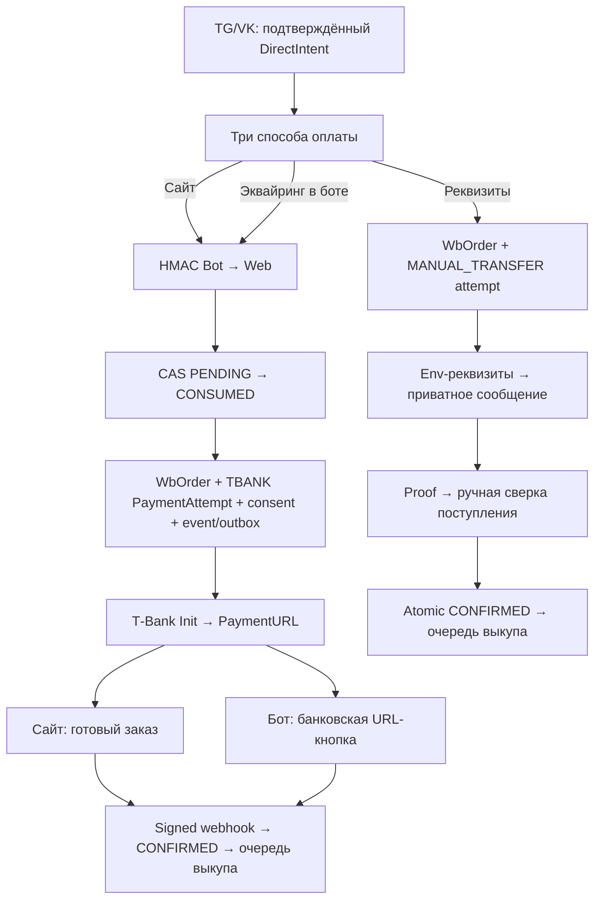

# Hybrid checkout прямых заказов в TG/VK

> Реализовано 09.08.2026. После подтверждения прямого заказа покупатель сам выбирает
> готовую оплату на сайте, эквайринг Т‑Банка прямо из бота либо перевод по реквизитам.
> Точные реквизиты — только runtime env/HANDOFF; в Git, Trello, API логах и публичной
> документации их нет.

## Что видит покупатель

```text
Заказ подготовлен
1000 R$ → PlayerName
К оплате: 800 ₽

На сайте удобнее: всё уже заполнено. Но можно остаться здесь.

[🌐 Оплатить на сайте]
[🏦 Эквайринг в боте]
[💳 Перевод по реквизитам]
[Оферта] [Политика]
[❌ Отменить]
```

Если у связанного web-профиля есть email, он используется для электронного чека. У
bot-only пользователя бот просит email одним сообщением и валидирует его до создания
оплаты. Нажатие способа после показа ссылок на документы является явным согласием;
`termsAcceptedAt/termsVersion` и append-only `ConsentEvidence` сохраняются на сервере.

### На сайте

Bot → Web API создаёт заказ и банковскую сессию, после чего бот отдаёт секретную ссылку
`/payment/status?orderId=…&token=…&source=bot`. Страница уже знает Roblox-ник, gamepass,
Robux, сумму и последний payment attempt. Покупателю остаётся нажать одну кнопку
«Оплатить … ₽»; она ведёт на `PaymentURL` Т‑Банка. Вход на сайт не требуется, потому что
ссылка защищена 256-битным bearer token, в БД хранится только SHA-256 hash.

### Эквайринг в боте

Используется тот же `WbOrder`, `PaymentAttempt(provider=TBANK)` и тот же `PaymentURL`, что
и в варианте «на сайте». Бот показывает банковскую URL-кнопку и отдельную кнопку статуса.
Signed webhook подтверждает оплату автоматически; скриншот не нужен. Поздний callback,
stale `GetState → Cancel`, повторный Init и компенсация bonus/discount используют общий
канонический payment lifecycle.

### Перевод по реквизитам

Web читает `MANUAL_TRANSFER_*` только из runtime env и возвращает реквизиты исключительно
подписанному запросу официального TG/VK-бота. В заказе сохраняется только config version,
а не номер/получатель. Создаётся `PaymentAttempt(provider=MANUAL_TRANSFER, INITIATED)`.
Покупатель присылает чек фотографией; сам чек не подтверждает деньги. Кнопка администратора
работает только для `MANUAL_TRANSFER`, атомарно переводит attempt в `CONFIRMED`, записывает
`paidAt`, event и outbox. Эквайринговый attempt этой кнопкой подтвердить нельзя.

## Архитектура



Главные компоненты:

- `POST /api/internal/bot-payments` — единственная серверная точка создания оплаты;
- `src/lib/canonical-bot-order.ts` — serializable consume intent, benefits, order,
  attempt, consent, event и outbox;
- `src/lib/bot-payment-auth.ts` + `bots/shared/bot-payment-api.ts` — HMAC SHA-256 по
  `timestamp.body`, окно 5 минут, secret не короче 32 символов;
- `GET /api/orders/[publicId]?token=…` — защищённый snapshot вместе с `paymentUrl`;
- `/payment/status` — prefilled handoff и polling terminal status;
- TG/VK callbacks несут только opaque intent ID и выбранный способ; сумма и реквизиты из
  callback не принимаются.

`publicOrderId` и status token детерминированы HMAC от intent ID. Поэтому повторный callback
после timeout/restart восстанавливает ту же секретную ссылку, а не создаёт второй заказ.
Уникальный `webIdempotencyKey=direct-intent:<id>` и CAS consume защищают от гонки нового
клиентского пути со старыми `sqi/spi` и TWA. Эти legacy/admin пути тоже переведены на CAS.
Допустимый HMAC replay в пределах пяти минут безопасен по эффекту: перед внешним `Init`
order/attempt атомарно переходят в `PAYMENT_PENDING/INITIATED`, и только победитель CAS
вызывает банк. Если банк уже ответил успешно, а сохранение ответа в БД упало, льготы не
компенсируются: попытка остаётся live для fail-closed reconciliation.

## Статусы и гарантии

| Событие | Order | Attempt |
|---|---|---|
| Создан заказ, до claim банковского Init | `AWAITING_PAYMENT` | `TBANK/CREATED` |
| Init claimed, ждём ответ банка | `PAYMENT_PENDING` | `TBANK/INITIATED` |
| Получен `PaymentURL` | `PAYMENT_PENDING` | `TBANK/INITIATED` |
| Выбран перевод | `PAYMENT_PENDING` | `MANUAL_TRANSFER/INITIATED` |
| Webhook банка | `PENDING` | `TBANK/CONFIRMED` |
| Админ сверил перевод | `PENDING` | `MANUAL_TRANSFER/CONFIRMED` |
| Init временно упал | заказ сохранён, льготы компенсированы | `FAILED`, разрешён retry ≤3 |
| Stale acquiring | после `GetState/Cancel` — `REJECTED` | terminal |

- SITE и BOT_ACQUIRING — две презентации одной банковской сессии, не два платежа.
- После выбора manual нельзя случайно получить T‑Bank ссылку для того же заказа, и наоборот.
- Скриншоты восстанавливаются из БД только для manual attempt или старого legacy-заказа.
- Старый `pay_ok` сохранён для совместимости, но при наличии attempt требует
  `provider=MANUAL_TRANSFER` и `status=INITIATED`.
- Bonus/discount резервируются в той же транзакции, возвращаются идемпотентно и повторно
  резервируются перед безопасным Init retry.
- Canonical manual confirmation уведомляет клиента только через durable outbox, поэтому
  повторный callback администратора не создаёт дубль сообщения.

## Конфигурация

Web:

```text
BOT_PAYMENT_API_SECRET=
MANUAL_TRANSFER_BANK=
MANUAL_TRANSFER_RECIPIENT=
MANUAL_TRANSFER_PHONE=
MANUAL_TRANSFER_CONFIG_VERSION=
```

TG и VK:

```text
WEB_BASE_URL=https://robloxbank.ru
BOT_PAYMENT_API_SECRET=  # точно тот же secret, что у Web
```

T‑Bank credentials остаются только у Web и reconciliation worker. Manual details не нужны
бот-контейнерам: они приходят по аутентифицированному внутреннему ответу и не логируются.

## ККТ и residual risk

Эквайринг передаёт `Receipt` с email покупателя. По разъяснениям ФНС, интернет-расчёты,
включая мессенджеры, требуют электронного кассового чека; онлайн-перевод сам по себе не
заменяет фискализацию:

- [ФНС: интернет-расчёты и электронный чек](https://www.nalog.gov.ru/rn22/news/activities_fts/16545576/);
- [ФНС: онлайн-перевод и обязанность выдать чек](https://www.nalog.gov.ru/rn63/ifns/imns63_24/info/16590505/).

Поэтому manual transfer остаётся явно ручным operational fallback. Владелец/бухгалтер
должны обеспечить формирование и доставку кассового чека, сверить допустимость получателя
и порядок возврата. Код фиксирует receipt email и audit trail, но не превращает личный
перевод в фискальный расчёт автоматически.

## Проверки релиза

- HMAC: правильная подпись, изменённое тело, stale timestamp, короткий/missing secret;
- ownership: TG/VK actor не может потребить или отменить чужой intent;
- двойной callback и гонка bot/TWA/admin дают один order/attempt;
- два быстрых нажатия вызывают ровно один provider Init; provider-success/DB-failure не
  запускает ложную компенсацию;
- SITE и BOT_ACQUIRING возвращают один `PaymentURL` и рабочую status URL;
- manual response появляется только при полной env-конфигурации;
- `pay_ok` подтверждает manual и отклоняет TBANK;
- webhook/GetState/retry/benefits/outbox regression suite;
- mobile/desktop status page, TG и VK keyboard limits;
- production smoke создаёт только неоплаченную банковскую сессию; реальные деньги без
  отдельного подтверждения не списываются.

## Осознанно оставлено на следующую итерацию

- хранить отдельный receipt contact в профиле (сейчас используется web email либо email,
  введённый для конкретного заказа);
- телефон для чека в bot UX (текущий fiscal contact — email);
- контролируемое переключение manual ↔ acquiring внутри уже созданного заказа через
  `GetState/Cancel`; сейчас после выбора способ зафиксирован, чтобы исключить двойную оплату;
- автоматическая фискализация manual transfer и task «чек сформирован»;
- полноценный Telegram/VK E2E harness; production acceptance реальным аккаунтом остаётся
  ручным, потому что автоматический тест не должен писать клиентам или списывать деньги.
