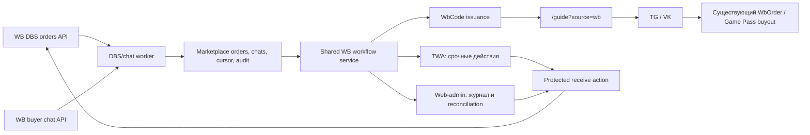

# WB DBS: чат → код получения → RobloxBank-гейт

Статус на 12.08.2026: **этапы 0–4 реализованы и развёрнуты в production shadow; migration
применена, read-only worker healthy, live chat/status mutations оставлены OFF до canary**.
Документ описывает новый контур заказов Wildberries
с доставкой продавцом (`deliveryType=dbs`). Текущий FBS-монитор и текущие физические
`WbCode` не покрывают этот сценарий.

## 1. Что уже подтверждено живым API

Read-only проверка production-ключа и только что завершённого заказа показала:

- новый заказ пришёл как **DBS**, а не FBS/DBW;
- заказ был доступен в DBS API до завершения и после завершения получил пару статусов
  `supplierStatus=receive`, `wbStatus=sold`;
- в заказе есть `rid`, `nmId`, артикул, цена, интервал доставки и данные, достаточные для
  привязки к товару и номиналу;
- в WB-чате карточка товара содержит тот же `rid` (`srid` в статистике), поэтому чат и
  заказ можно связать без догадок по имени, времени или сумме;
- список чатов, события, `replySign` и отправка ответа доступны текущему ключу;
- официальный API гарантирует ответ **в уже существующий чат**. Создание диалога продавцом
  сейчас не входит в стабильный публичный контракт: ошибочно опубликованный в марте 2026
  endpoint был отозван WB. Если покупатель ещё не открыл чат, интерфейс должен показать
  ручной fallback через кабинет продавца, а не обещать автоматическую отправку.

Официальные контракты: [DBS-заказы](https://dev.wildberries.ru/ru/openapi/orders-dbs/),
[чаты с покупателями](https://dev.wildberries.ru/ru/openapi/user-communication).

## 2. Целевой клиентский сценарий

1. Worker сразу сохраняет новый DBS-заказ из `GET /api/v3/dbs/orders/new`. Это обязательно:
   после ухода заказа из `new` его полная карточка снова доступна только после продажи или
   отмены.
2. Номинал берётся из доверенного сопоставления `nmId → WbProductCost.denomination` и
   фиксируется snapshot-ом на заказе. Цена, сообщение покупателя и введённые им данные не
   могут изменить номинал.
3. Worker получает события WB-чатов и связывает событие с заказом по
   `goodCard.rid = marketplaceOrder.rid`.
4. Если чат существует, менеджер в TWA или web-admin отправляет шаблон с просьбой прислать
   код получения из заказа WB. Если чат ещё не создан покупателем, карточка остаётся в
   состоянии «Ожидаем чат» и предлагает открыть заказ в кабинете WB.
5. После состояния `CODE_REQUESTED` входящее сообщение с шестью цифрами зашифровывается и
   маскируется до persistence, но **не завершает заказ автоматически**. Есть защищённый
   резервный ввод; raw code не возвращается клиенту.
6. Одна транзакция создаёт новый уникальный `WbCode`, связывает его с DBS-заказом и
   фиксирует номинал. Повтор того же действия возвращает уже созданный код, а не выпускает
   второй.
7. В WB-чат уходит сообщение с двумя отдельными значениями:
   `https://robloxbank.ru/guide?source=wb` и наш семисимвольный код. Код доставки WB в
   ссылку или ответ не включается.
8. Только после успешного сохранения кода и подтверждённой отправки/ручной фиксации выдачи
   менеджер нажимает «Подтвердить получение в WB». Backend вызывает
   `POST /api/marketplace/v3/dbs/orders/status/receive` с `orderId` и кодом покупателя.
9. Покупатель вводит наш код на гейте и проходит существующий путь: TG или VK → канал/
   группа → инструкция → ник Roblox или Game Pass → очередь выкупа.
10. TWA и web-admin показывают рядом, но не смешивают, два результата: заказ закрыт в WB и
    внутренний заказ RobloxBank выполнен. Расхождение всегда остаётся в очереди внимания.

Продуктовое решение по умолчанию: WB-заказ можно завершить после **надёжной выдачи**
валидного гейт-кода, не дожидаясь будущего выкупа Game Pass. Это соответствует заявленному
воркфлоу, но создаёт обязательный SLA: любой `WB_RECEIVED`, у которого внутренний заказ не
дошёл до `COMPLETED`, должен оставаться видимым до исполнения или ручного урегулирования.

## 3. Почему нельзя сделать один общий статус

У заказа четыре независимые оси. Сведение их в один enum потеряет реальные состояния и
сделает recovery небезопасным.

| Ось | Состояния |
|-----|-----------|
| WB delivery | `NEW → CONFIRM → DELIVER → RECEIVE` или `REJECT/CANCEL` |
| Чат | `UNKNOWN → WAITING_BUYER_CHAT → READY → CODE_REQUESTED → CODE_RECEIVED` |
| Выдача гейта | `NOT_ISSUED → ISSUED → SENT`, отдельно `SEND_FAILED/REVOKED` |
| RobloxBank | текущие `WbCode` + `WbOrderStatus`: `AWAITING_GAMEPASS → PENDING → IN_PROGRESS → COMPLETED` |

Операторская очередь вычисляется из сочетаний:

- `NEW/CONFIRM + chat unknown` → синхронизировать заказ и чат;
- `DELIVER + READY` → попросить код получения;
- `CODE_RECEIVED + NOT_ISSUED` → выпустить гейт-код;
- `SENT + DELIVER` → разрешить подтверждение получения в WB;
- `RECEIVE + internal != COMPLETED` → сопровождать выполнение;
- любой API error, неизвестный номинал или конфликт `rid/nmId` → `NEEDS_ATTENTION`.

## 4. Целевая архитектура

### Компоненты

- `bots/shared/wb-delivery-api.ts` — DBS + chat endpoints и protected mutations;
- `bots/shared/wb-delivery-contract.ts` — tolerant contracts и нормализация IDs;
- `bots/shared/wb-delivery-sync.ts` — быстрый sync с DB lease, cursor и дедупликацией;
- `src/lib/wb-delivery-workflow.ts` — единые invariants/actions для web-admin и TWA;
- `/api/twa/wb-delivery/*` и `/api/admin/wb-delivery/*` — разные auth-обёртки над одним
  сервисом, а не две реализации бизнес-логики;
- отдельные экраны DBS inbox в TWA и `/admin/wildberries/delivery` на desktop;
- существующий `/guide?source=wb`, TG/VK и buyout pipeline используются после выдачи кода
  без форка клиентской инструкции.

Worker должен запускаться в одном процессе или иметь DB lease. Одновременный запуск в TG,
VK и Web без lease запрещён: он создаст дубли сообщений и гонки статусов.

## 5. Предлагаемая модель данных

Имена окончательно фиксируются перед миграцией, но границы сущностей обязательны.

### `WbMarketplaceOrder`

| Поле | Назначение |
|------|------------|
| `id` | внутренний cuid |
| `wbOrderId` | ID сборочного задания как строка: не теряем точность `int64` в JSON |
| `fulfillmentModel` | `DBS`, позже `DBW/FBS` без смешивания endpoint-ов |
| `rid`, `orderUid`, `groupId` | стабильная корреляция и дедупликация |
| `nmId`, `vendorCode`, `article` | товар WB |
| `denominationSnapshot` | доверенный номинал на момент выдачи |
| `priceKopecks`, `finalPriceKopecks`, `currency` | денежный snapshot после явной нормализации единиц WB |
| `deliveryFrom`, `deliveryTo` | SLA и сортировка срочной очереди |
| `supplierStatus`, `wbStatus` | последние статусы WB |
| `chatState`, `gateState` | независимые состояния нашего процесса |
| `wbCodeId`, `internalOrderId` | уникальные связи с выдачей и текущим `WbOrder` |
| `lastSeenAt`, `completedAt`, `cancelledAt` | reconciliation |

Адрес, ФИО и телефон не нужны для цифровой выдачи по умолчанию и не сохраняются. Если
операционный кейс всё же потребует их показа, сохранять только зашифрованный минимальный
snapshot с короткой ретенцией, без raw JSON ответа WB.

### `WbBuyerChat` и `WbBuyerChatEvent`

- `chatId` и `eventId` уникальны;
- `replySign` хранится зашифрованно;
- event связывается с order по `rid`, хранит направление, время, тип и безопасный текст;
- вложения — только metadata/временная ссылка, без фонового скачивания;
- после распознавания кода получения в тексте остаётся маска `••••••`, а секрет выносится
  в отдельную short-lived запись;
- cursor `next` сохраняется в `WbSyncCursor`, поэтому рестарт не теряет события.

### `WbDeliverySecret`

- один активный секрет на marketplace order;
- шифротекст AES-256-GCM/KMS, `keyVersion`, IV/tag и HMAC для дедупликации;
- `receivedAt`, `expiresAt`, `consumedAt`, `failedAttempts`;
- plaintext доступен только внутри protected receive action и никогда не возвращается в
  list API;
- шифротекст удаляется сразу после подтверждённого `receive`, максимум через 24 часа.

### Изменения существующих моделей

- `WbCode`: nullable unique relation к `WbMarketplaceOrder`; legacy physical-коды не требуют
  backfill, generated batch маркируется `DBS-YYYY-MM`;
- `WbOrder` не меняется: внутренний buyout находится по уникальному `wbCode`, чтобы не
  добавлять второй nullable foreign key;
- `WbProductCost.denomination` остаётся источником product mapping. Пустое значение —
  fail-closed, выпуск кода запрещён;
- отдельный append-only `WbMarketplaceEvent` хранит actor, действие, before/after status,
  WB request ID и безопасный error code. Код получения и полный текст чата туда не пишутся.

Существующий `WbOrder` — это внутренний заказ на выкуп Roblox, а не заказ маркетплейса.
Переименовывать или переиспользовать его для DBS нельзя.

## 6. Контракты WB API

### DBS

| Действие | Метод | Правило |
|----------|-------|---------|
| Поймать новый заказ | `GET /api/v3/dbs/orders/new` | poll 20–30 с, upsert до любых status actions |
| Завершённые заказы | `GET /api/v3/dbs/orders` | backfill/reconciliation, период ≤30 дней |
| Статусы | `POST /api/marketplace/v3/dbs/orders/status/info` | batches до 1000 ID |
| Покупатель | `POST /api/v3/dbs/orders/client` | только при необходимости и после `confirm`; не сохранять лишнее |
| В сборку | `POST /api/marketplace/v3/dbs/orders/status/confirm` | protected action |
| В доставку | `POST /api/marketplace/v3/dbs/orders/status/deliver` | protected action |
| Получен | `POST /api/marketplace/v3/dbs/orders/status/receive` | `{orders:[{orderId,code}]}`; только после `gateState=SENT` |

Старые `PATCH /api/v3/dbs/orders/{orderId}/receive|reject` не использовать: WB пометил их
deprecated и объявил удаление 13 апреля. Bulk-ответ надо проверять по `results[]`: HTTP 200
сам по себе не означает успех каждого заказа.

### Чаты

| Действие | Метод | Правило |
|----------|-------|---------|
| Список | `GET /api/v1/seller/chats` | сохранить `chatID/replySign`, не логировать ответ |
| События | `GET /api/v1/seller/events?next=` | cursor до `totalEvents=0`, дедуп по event ID |
| Ответ | `POST /api/v1/seller/message` | multipart, `replySign`, текст ≤1000 символов |

Документированный лимит чатов — 10 запросов за 10 секунд, интервал 1 секунда. Нормальный
poll — 2–5 секунд с jitter; `429` и `5xx` получают exponential backoff. Отправка сообщения
должна иметь локальный idempotency key и визуальный статус `sending/sent/unknown`, потому
что у внешнего API нет нашей транзакции.

## 7. Инварианты и порядок защищённых действий

### Выпуск гейт-кода

Транзакция `issueGateCode(marketplaceOrderId)`:

1. блокирует строку marketplace order;
2. требует `fulfillmentModel=DBS`, активный WB-заказ и известный `denominationSnapshot`;
3. возвращает существующий `wbCodeId`, если код уже выпущен;
4. генерирует 7 символов криптографическим RNG из однозначного alphabet без
   `0/O` и `1/I`, проверяет unique conflict и повторяет;
5. создаёт `WbCode(status=AVAILABLE, batch=DBS-YYYY-MM)` и уникальную связь с заказом;
6. пишет audit event после commit.

Номинал нельзя передавать из TWA body. Backend всегда читает snapshot заказа.

### Отправка покупателю

- сообщение формируется серверным template ID/version, свободный текст — отдельное поле;
- gate URL не содержит ни код получения WB, ни `replySign`, ни персональные данные;
- предпочтительный первый релиз — общая ссылка `/guide?source=wb` + код отдельной строкой;
- будущий бесшовный вариант использует одноразовый opaque handoff token, в БД только hash;
- `gateState=SENT` ставится только после подтверждённого WB API ответа. При timeout —
  `SEND_UNKNOWN`, оператор сначала перечитывает события, а не нажимает отправку вслепую.
- перед внешней отправкой гейт атомарно переходит `ISSUED → SENDING`; повторная кнопка
  блокируется. Завершить `SENDING`/`SEND_UNKNOWN` вручную можно только после проверки
  WB-чата явным действием, которое оставляет audit event.

### Подтверждение получения в WB

Backend принимает `marketplaceOrderId` и явное подтверждение UI, но не принимает
произвольный `orderId`. Перед внешним вызовом он требует:

- WB status `deliver`;
- `gateState=SENT` или отдельный audited manual-delivery override;
- активный неистёкший `WbDeliverySecret`;
- отсутствие успешного `receive` event;
- актуальную повторную сверку статуса WB.

После вызова проверяются `results[].isError`, сохраняется `requestId`, секрет помечается
consumed и очищается. Повтор при `receive/sold` считается успешным reconciliation, но не
делает второй внешний вызов. `400/409` не списывают секрет и создают actionable error;
`401/403` останавливают worker mutation и уведомляют админов о токене/правах.

## 8. UX в TWA

TWA остаётся мобильной очередью срочных действий, а не полной копией кабинета.

### Новый раздел «WB Доставка»

- счётчики: `Новые`, `Ждём чат`, `Ждём код`, `Код получен`, `Готово подтвердить`,
  `Нужна помощь`;
- сортировка по окончанию delivery window, затем по возрасту;
- карточка: номинал, артикул, время доставки, WB status, chat/gate/internal status;
- PII по умолчанию скрыта; код получения показывается как `••••••`;
- быстрые действия появляются только когда разрешены state machine.

### Карточка заказа

1. компактный timeline WB + RobloxBank;
2. последние сообщения чата с направлением и временем;
3. кнопки шаблонов «Попросить код» и «Отправить ссылку + наш код»;
4. найденный код — отдельная protected-карточка с `Подтвердить`/`Не код`;
5. финальное действие «Подтвердить получение в WB» открывает экран сверки:
   номинал, последние 4 символа нашего кода, status `deliver`, факт отправки сообщения;
6. после успеха кнопка исчезает, появляется WB `receive/sold` и ссылка на внутренний заказ;
7. `SEND_UNKNOWN`, WB `409`, неизвестный номинал и несовпадение `rid` нельзя скрыть свайпом.

Свободный ответ в чат нужен, но шаблоны должны быть основным путём. В TWA не показывать
адрес и телефон, если действие не требует их.

## 9. UX в desktop `/admin`

Новый маршрут `/admin/wildberries/delivery`:

- широкая таблица с фильтрами по периоду, товару, WB/chat/gate/internal status и проблемам;
- detail drawer: полный audit timeline, безопасный transcript, product mapping и результаты
  каждого внешнего запроса;
- те же protected actions через shared service;
- ручная привязка чата к заказу разрешена только после показа `rid/nmId` и двойного
  подтверждения; изменения аудируются;
- `Re-sync` перечитывает status/events, но не отправляет сообщения и не меняет WB status;
- отдельный экран product mapping `nmId → denomination`; изменение влияет только на новые
  snapshot-ы, исторические заказы не пересчитываются;
- reconciliation-фильтр: WB закрыт, но код не выдан; код выдан, но WB не закрыт; внутренний
  заказ завис; чат не сопоставлен; secret истёк; duplicate/unknown send.

TWA и desktop используют одинаковые DTO, permission checks и state transitions. Desktop
даёт больше контекста, но не имеет «обходных» небезопасных действий.

## 10. Тексты сообщений первой версии

### Запрос кода

> Здравствуйте! Чтобы получить инструкцию и код RobloxBank, откройте этот заказ в приложении
> Wildberries и пришлите сюда код подтверждения получения. Отправляя код, вы подтверждаете
> получение заказа в Wildberries. Никому, кроме этого чата с продавцом, код не сообщайте.

### Выдача гейта

> Спасибо! Перейдите на https://robloxbank.ru/guide?source=wb и введите код: `{WB_CODE}`.
> Дальше выберите Telegram или ВКонтакте и следуйте инструкции. Код доставки Wildberries на
> сайте RobloxBank вводить не нужно.

### Чат ещё не доступен API

Покупателю ничего автоматически не отправляется. Менеджер видит: «Покупатель ещё не начал
чат. Откройте диалог в кабинете WB или дождитесь первого сообщения». После появления события
worker продолжает тот же заказ, не создавая новый.

Тексты должны храниться версионно и пройти ручную проверку поддержки/комплаенса до canary.

## 11. Безопасность и приватность

- разделить текущий широкий RW-токен на минимум `WB_MARKETPLACE_TOKEN` и `WB_CHAT_TOKEN`;
  аналитика/реклама — отдельные read-only токены;
- secrets только в env/secret store, никогда в БД, Git, Trello или клиентском bundle;
- код получения WB — одноразовый высокорисковый credential: шифрование, TTL, маскирование,
  запрет в logs/traces/analytics/error payloads;
- `replySign`, чат и возможные ПД — server-only, минимальная ретенция;
- все mutation actions требуют актуальный admin session/TWA initData, CSRF/origin guard,
  role check, rate limit и append-only audit;
- запретить bulk `receive` из UI первой версии: один заказ и одно явное подтверждение;
- customer messages не отправлять из dry-run, preview, test order или shadow mode;
- новый worker начинает с `WB_DBS_MUTATIONS_ENABLED=false` и
  `WB_CHAT_SEND_ENABLED=false`;
- логи содержат внутренний ID, stage, HTTP status, WB error code и request ID, но не body,
  адрес, телефон, текст чата, activation/delivery code или `replySign`.

Полный risk register: [security.md](security.md#wb-dbs-delivery-code).

## 12. Наблюдаемость и алерты

Метрики:

- lag последнего успешного orders poll и chat cursor;
- новые DBS, заказы без product mapping, несопоставленные чаты;
- время `order seen → code requested → gate sent → WB receive → internal completed`;
- `send_failed/send_unknown`, `receive_failed`, `429`, `401/403`, WB partial errors;
- `WB_RECEIVED && internal != COMPLETED` по возрастным корзинам;
- secrets active/expired/consumed без вывода значений.

Алерты:

- worker heartbeat старше 2 минут;
- новый DBS не сохранён/не классифицирован за 2 минуты;
- chat cursor не двигается 5 минут при новых событиях;
- `401/403` — немедленно, mutations kill-switch OFF;
- delivery window заканчивается менее чем через час, а gate не выдан;
- WB закрыт более 24 часов, внутренний заказ не создан;
- внутренний заказ не `COMPLETED` дольше принятого SLA.

## 13. Этапы реализации

### Production acceptance 12.08.2026

- additive migration применена после backup; Prisma migration status актуален;
- Web/TG/VK развёрнуты, Guide синхронизируется после Web и проверяется release fingerprint;
- read-only worker импортировал реальный DBS и buyer-chat, heartbeat/cursors стали
  `HEALTHY/OK`; фактический `errors: null` в `status/info` закреплён tolerant regression;
- завершённый feed/status помечается terminal и не остаётся в активной очереди;
- replacement `nmId` сопоставляется с доверенным каталогом через vendor article-prefix;
  номинал по-прежнему читается только из `WbProductCost`, а не из WB-поля;
- desktop production synthetic E2E прошёл
  `request → encrypted code → issue gate → send → confirm → deliver → receive/sold`;
  transcript скрыл оба кода, delivery secret после успеха заменён на `PURGED`;
- anonymous admin/TWA API возвращают `401`, desktop page перенаправляет на admin login;
- обычный mobile browser без Telegram `initData` получает fail-closed «Доступ запрещён»;
  визуальная TWA-приёмка владельцем выполняется только из Telegram;
- `WB_CHAT_SEND_ENABLED=false` и `WB_DBS_MUTATIONS_ENABLED=false`; scoped Marketplace/Chat
  tokens, 24 часа shadow и один согласованный live canary остаются незакрытыми gate этапа 5.

Текущее покрытие: foundation, shadow sync, ручной чат, atomic gate issuance и protected
receive реализованы. Синтетический production-safe E2E доступен из TWA/desktop.

### Live-режим и урок первого реального заказа (16.08.2026)

Первый реальный DBS-заказ `5507223980` встал намертво, и ни одна из трёх причин не ловилась
демо-прогоном, потому что `isTest`-заказы обходят оба флага и всю логику чата WB.

1. **Захват кода зависел от нашего же состояния.** `syncChatEvents` сохранял код покупателя
   только при `chatState in (CODE_REQUESTED, REQUEST_SEND_UNKNOWN)`. Оператор отправил
   запрос вручную из кабинета WB, поэтому наш `chatState` остался `READY`: событие
   покупателя пришло, `containsDeliveryCode=true` проставился, а `WbDeliverySecret` не
   создался — и весь дальнейший конвейер (гейт → receive) был заблокирован.
   Теперь захват решает `canCaptureDeliveryCode()`: единственные условия — заказ не закрыт
   и нет живого секрета. Кто и откуда просил код, значения не имеет.
2. **Исходящие сообщения из кабинета WB были невидимы.** Продавцовое событие из фида не
   двигало `chatState`, и консоль продолжала предлагать «Отправить инструкцию» после того,
   как её уже отправили руками. Добавлен `shouldMarkCodeRequested()`: `READY` /
   `WAITING_BUYER_CHAT` → `CODE_REQUESTED` + запись в аудит с `source: wb-seller-cabinet`.
3. **Флаги молчали.** `WB_CHAT_SEND_ENABLED` / `WB_DBS_MUTATIONS_ENABLED` были `false`, но в
   интерфейсе это был только мелкий чип «Чат OFF». Кнопки нажимались и падали в 409.
   Добавлены баннер на весь экран, `blockedReason` в DTO и подсказки на неактивных кнопках.

Сопутствующее: код доставки принимается в формате 5–6 цифр (пять — только если покупатель
прислал одно число и ничего больше), текст запроса приведён к утверждённому владельцем,
добавлен `backfillDeliveryCodes()` — курсор фида событий необратим, поэтому пропущенный код
иначе не переиграть.

**Правило:** зелёный демо-прогон не является приёмкой DBS. Любое изменение потока
проверяется либо на реальной карточке, либо сверкой env и `blockedReason`.

### Закрытие заказа вне консоли = «покупатель не обслужен»

Заказ `5507223980` был доведён до `receive/sold` из кабинета WB, а не нашей кнопкой:
в аудите нет `WB_RECEIVE_SUCCEEDED`, зато `status/info` отдаёт `receive`. Прежняя политика
считала любой `completedAt` концом истории и гасила выпуск гейта — деньги приняты,
покупатель без кода, консоль молчит.

Разделили два разных факта: закрытие сделки на маркетплейсе и выполнение нашего
обязательства. Дискриминатор — живой секрет: наш собственный `receive` затирает код в
`PURGED`, поэтому **живой** секрет при `completedAt` может означать только закрытие в обход
нас. Это состояние (`isWbBuyerUnserved`) даёт стадию `attention`, красный баннер и поле
`unserved` в DTO; выпуск и отправка гейта плюс ответ в чат теперь гейтятся на
`cancelledAt`, а не на `completedAt`. Сами WB-мутации (`confirm`/`deliver`/`receive`)
остаются строго terminal-only.

### Ссылка на гейт: `skip=1` и `code=` — разные вещи

`/guide` читает два независимых параметра: `skip=1` пропускает вступительный экран и
открывает сразу форму ввода кода, а `code=` подставляет сам код — но **только когда задан
`skip`** (`wbCodeFromUrl = skipGate && code` в `src/app/guide/page.tsx`). То есть ссылка с
кодом обязана нести оба параметра, иначе покупатель всё равно печатает код руками.

DBS-гейт слал `?source=wb&skip=1` без кода: функция `gateUrl(code)` принимала код и
выбрасывала его, использовав только как проверку на наличие. Все остальные 20+ мест в
ботах уже строят `?source=wb&skip=1&code=…` (правило: личная ссылка везде, где есть код;
generic — только в cold-start велкоме). Ссылка и текст сообщения сведены в единый
`bots/shared/wb-gate-link.ts`, чтобы консоль и авто-гейт не разошлись в том, что видит
покупатель. Заодно `redactWbChatText` научился прятать код и внутри `code=` в URL —
прежний паттерн ловил только прозаическое «код активации: …».

### Код активации и отдельный источник заказа `WB_DBS`

Код гейта — те же 7 символов из алфавита без `I/O/0/1`, что и на печатных карточках,
поэтому сайт (`/api/wb-code`, `^[A-Z0-9]{7}$`) и оба бота принимают его без изменений.
Одна ловушка была скрытой: боты считают сообщение WB-кодом только при
`/^[A-Za-z0-9]{7}$/` **и** наличии буквы, а равномерная выборка даёт код из одних цифр
раз на 16 384. Генератор теперь один (`bots/shared/wb-activation-code.ts`) и ставит
букву явно; тест сверяет вывод с точными регэкспами сайта и обоих `handlers.ts`.

Заказ, пришедший по такому коду, помечается `OrderSource.WB_DBS` — рядом с
`WB / DIRECT / AVITO / SITE / MANUAL`. Источник выводится не из имени батча, а из связи
`WbCode ↔ WbMarketplaceOrder` (`bots/shared/wb-order-source.ts`) в момент создания
`WbOrder` во всех пяти точках TG/VK. Резолвер fail-open: ошибка чтения даёт `WB`, потому
что классификация не должна ломать создание заказа покупателя.

`WB_DBS` намеренно **не** входит в `DIRECT_ECONOMICS_SOURCES` — это продажа WB, а не
прямая. Во всех очередях выкупа он ведёт себя как обычный WB (фильтры смотрят
`orderSource != 'AVITO'`), то есть попадает в выкуп штатно. Миграция
`20260816_order_source_wb_dbs` аддитивная: `ALTER TYPE … ADD VALUE IF NOT EXISTS`.

### Этап 0 — foundation и contract fixtures

- Prisma migration для marketplace order/chat/cursor/secret/audit и связей;
- типизированные safe DTO, redaction и crypto helper;
- fixtures только с синтетическими IDs/PII;
- contract-тесты парсинга нового/завершённого DBS, статусов, partial bulk response и chat
  events;
- product mapping для каждого активного DBS `nmId`.

**Готово:** schema validate, migration test, unit/contract tests; production mutations OFF.

### Этап 1 — read-only shadow sync

- poll `/dbs/orders/new`, completed orders, status info и chats/events;
- DB lease, cursor, дедуп, backoff, heartbeat;
- сопоставление строго по `rid`, отчёт о конфликтах;
- read-only таблица в desktop и очередь в TWA.

**Готово:** тестовый и реальный заказ появляются ≤60 секунд, рестарт не создаёт дублей,
существующий FBS/analytics монитор не затронут.

### Этап 2 — чат с ручным контролем

- transcript и шаблоны;
- отправка только из detail card, feature flag + confirm;
- распознавание/маскирование delivery code, secret TTL;
- fallback для отсутствующего buyer-created chat.

**Готово:** ответ виден в WB, повтор после timeout безопасен, код отсутствует в логах/API.

### Этап 3 — выпуск и выдача гейт-кода

- atomic `issueGateCode`, relation к marketplace order;
- server template «ссылка + код»;
- существующий gate/TG/VK принимает generated DBS code;
- reconciliation для issued/sent/claimed/internal order.

**Готово:** один DBS-заказ никогда не получает два кода; номинал нельзя подменить; полный
тестовый flow до `AWAITING_GAMEPASS/PENDING` проходит в TG и VK.

### Этап 4 — protected WB receive

- новый bulk endpoint, но один order/action из UI;
- precondition check, double confirm, audit, partial-result parser;
- очистка delivery secret и status reconciliation;
- `401/403` kill-switch и понятный recovery для `400/409/timeout`.

**Готово:** sandbox и согласованный canary завершают DBS ровно один раз; ни один receive не
возможен до выдачи гейт-кода.

### Этап 5 — production canary

1. 24 часа read-only на всех заказах;
2. один тестовый DBS: ручной chat send, ручная выдача, ручной receive;
3. 3–5 реальных DBS только выбранными админами;
4. 25% новых DBS, затем 100% после 48 часов без duplicate/lost/PII incidents;
5. auto-detection можно включить, auto-receive остаётся OFF до отдельного решения.

Stop conditions: неверный номинал, duplicate code/message, несопоставленный `rid`, утечка
секрета/PII, `receive` без `SENT`, потеря cursor, WB `401/403`, два unresolved `SEND_UNKNOWN`.

## 14. Проверки перед production

- migration deploy сначала, затем Web и единственный worker;
- Prisma validate/generate, TypeScript root/TG/VK, lint и существующие tests;
- новые unit/contract tests state machine, code issuance, redaction, crypto/TTL, cursor,
  idempotency и partial WB responses;
- integration sandbox: `new → confirm → deliver → receive/sold`;
- TG и VK: generated code → identity → group/channel → guide → nick/GP;
- TWA iOS/Android и desktop: все разрешённые/запрещённые кнопки;
- поиск по логам/telemetry на delivery code, activation code, `replySign`, телефон, адрес;
- backup и rollback: mutations OFF, worker read-only, данные/аудит сохраняются;
- ручная сверка WB кабинета, API status и внутреннего timeline.

## 15. Definition of Done

Сценарий считается внедрённым, когда:

1. каждый новый DBS-заказ сохраняется до ухода из `/new` и сопоставляется с товаром;
2. существующий WB-чат связывается с заказом по `rid`, ответ виден покупателю;
3. один заказ получает ровно один generated `WbCode` правильного номинала;
4. покупатель проходит текущий WB-гейт в TG и VK без отдельной инструкции;
5. код получения WB не попадает в URL, логи, Trello и постоянный transcript;
6. `receive` невозможен до подтверждённой выдачи нашего кода и идемпотентен;
7. TWA даёт срочные действия, desktop — поиск, аудит и reconciliation;
8. seller-first chat честно имеет manual fallback, пока WB не вернёт официальный endpoint;
9. любое расхождение WB/internal остаётся видимым до закрытия;
10. canary пройден без потерянных заказов, дублей сообщений/кодов и утечек ПД.
